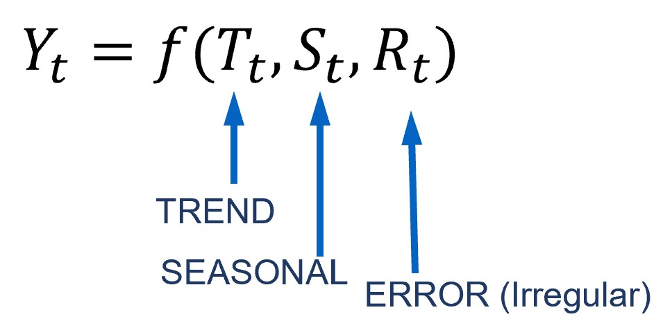
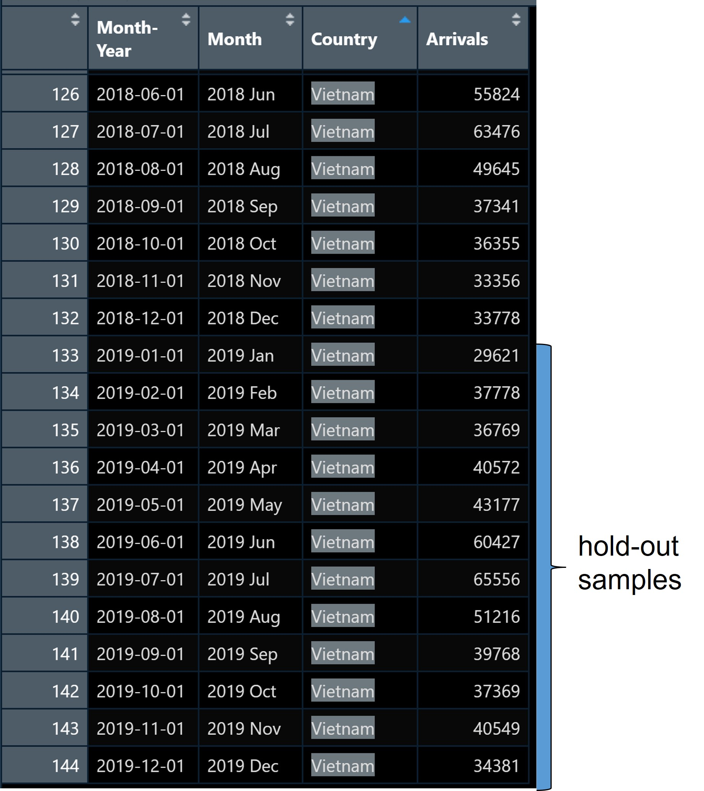

## Learning Outcome

[tidyverts](https://tidyverts.org/) is a family of R packages specially designed for visualising, analysing and forecasting time-series data conforming to tidyverse framework. It is the work of [Dr. Rob Hyndman](https://robjhyndman.com/), professor of statistics at Monash University, and his team. The family of R packages are intended to be the next-generation replacement for the very popular [forecast](https://pkg.robjhyndman.com/forecast/) package, and is currently under active development.

The main reference for tidyverts is the textbook [Forecasting: Principles and Practice, 3rd Edition](https://otexts.com/fpp3/), by Hyndman and Athanasopoulos. It’s highly recommended to read that in conjunction with working through the notebooks here.

By the end of this session, you will be able to:

-   import and wrangling time-series data by using appropriate tidyverse methods,
-   visualise and analyse time-series data,
-   calibrate time-series forecasting models by using exponential smoothing and ARIMA techniques, and
-   compare and evaluate the performance of forecasting models.

## Getting Started

For the purpose of this hands-on exercise, the following R packages will be used.

```{r}
pacman::p_load(tidyverse, tsibble, feasts, fable, seasonal)
```

-   [**lubridate**](https://lubridate.tidyverse.org/) provides a collection to functions to parse and wrangle time and date data.
-   tsibble, feasts, fable and fable.prophet are belong to [**tidyverts**](https://tidyverts.org/), a family of tidy tools for time series data handling, analysis and forecasting.
    -   [**tsibble**](https://tsibble.tidyverts.org/) provides a data infrastructure for tidy temporal data with wrangling tools. Adapting the tidy data principles, tsibble is a data- and model-oriented object.
    -   [**feasts**](https://feasts.tidyverts.org/) provides a collection of tools for the analysis of time series data. The package name is an acronym comprising of its key features: Feature Extraction And Statistics for Time Series.

### Importing the data

First, `read_csv()` of **readr** package is used to import *visitor_arrivals_by_air.csv* file into R environment. The imported file is saved an tibble object called *ts_data*.

```{r}
ts_data <- read_csv(
  "data/visitor_arrivals_by_air.csv")
```

In the code chunk below, `dmy()` of **lubridate** package is used to convert data type of Month-Year field from Character to Date.

```{r}
ts_data$`Month-Year` <- dmy(
  ts_data$`Month-Year`)
```

### Conventional base `ts` object versus `tibble` object

tibble object

```{r}
ts_data
```

### Conventional base `ts` object versus `tibble` object

ts object

```{r}
ts_data_ts <- ts(ts_data)       
head(ts_data_ts)
```

### Converting `tibble` object to `tsibble` object

Built on top of the tibble, a **tsibble** (or tbl_ts) is a data- and model-oriented object. Compared to the conventional time series objects in R, for example ts, zoo, and xts, the tsibble preserves time indices as the essential data column and makes heterogeneous data structures possible. Beyond the tibble-like representation, key comprised of single or multiple variables is introduced to uniquely identify observational units over time (index).

The code chunk below converting ts_data from tibble object into tsibble object by using [`as_tsibble()`](https://tsibble.tidyverts.org/reference/as-tsibble.html) of **tsibble** R package.

```{r}
ts_tsibble <- ts_data %>%
  mutate(Month = yearmonth(`Month-Year`)) %>%
  as_tsibble(index = `Month`)
```

What can we learn from the code chunk above? + [`mutate()`]() of **dplyr** package is used to derive a new field by transforming the data values in Month-Year field into month-year format. The transformation is performed by using [`yearmonth()`](https://tsibble.tidyverts.org/reference/year-month.html) of **tsibble** package. + [`as_tsibble()`](https://tsibble.tidyverts.org/reference/as-tibble.html) is used to convert the tibble data frame into tsibble data frame.

### tsibble object

```{r}
ts_tsibble
```

## Visualising Time-series Data

In order to visualise the time-series data effectively, we need to organise the data frame from wide to long format by using [`pivot_longer()`](https://tidyr.tidyverse.org/reference/pivot_longer.html) of **tidyr** package as shown below.

```{r}
ts_longer <- ts_data %>%
  pivot_longer(cols = c(2:34),
               names_to = "Country",
               values_to = "Arrivals")

```

### Visualising single time-series: ggplot2 methods

```{r eval=FALSE}
ts_longer %>%
  filter(Country == "Vietnam") %>%
  ggplot(aes(x = `Month-Year`, 
             y = Arrivals))+
  geom_line(size = 0.5)
```

What can we learn from the code chunk above?

-   [`filter()`](https://dplyr.tidyverse.org/reference/filter.html) of [**dplyr**](https://dplyr.tidyverse.org/index.html) package is used to select records belong to Vietnam.
-   [`geom_line()`](https://ggplot2.tidyverse.org/reference/geom_path.html) of [**ggplot2**](https://ggplot2.tidyverse.org/index.html) package is used to plot the time-series line graph. \]

```{r echo=FALSE, fig.height=6}
ts_longer %>%
  filter(Country == "Vietnam") %>%
  ggplot(aes(x = `Month-Year`, 
             y = Arrivals))+
  geom_line(size = 1)
```

### Plotting multiple time-series data with ggplot2 methods

```{r}
#| fig-height: 8
ggplot(data = ts_longer, 
       aes(x = `Month-Year`, 
           y = Arrivals,
           color = Country))+
  geom_line(size = 0.5) +
  theme(legend.position = "bottom", 
        legend.box.spacing = unit(0.5, "cm"))
```

In order to provide effective comparison, [`facet_wrap()`](https://ggplot2.tidyverse.org/reference/facet_wrap.html) of **ggplot2** package is used to create small multiple line graph also known as trellis plot.

```{r eval=FALSE}
ggplot(data = ts_longer, 
       aes(x = `Month-Year`, 
           y = Arrivals))+
  geom_line(size = 0.5) +
  facet_wrap(~ Country,
             ncol = 3,
             scales = "free_y") +
  theme_bw()
```

```{r}
#| echo: false
#| fig-height: 12
ggplot(data = ts_longer, 
       aes(x = `Month-Year`, 
           y = Arrivals))+
  geom_line(size = 0.5) +
  facet_wrap(~ Country,
             ncol = 3,
             scales = "free_y") +
  theme_bw()
```

## Visual Analysis of Time-series Data

-   Time series datasets can contain a seasonal component.

-   This is a cycle that repeats over time, such as monthly or yearly. This repeating cycle may obscure the signal that we wish to model when forecasting, and in turn may provide a strong signal to our predictive models.

In this section, you will discover how to identify seasonality in time series data by using functions provides by **feasts** packages.

In order to visualise the time-series data effectively, we need to organise the data frame from wide to long format by using [`pivot_longer()`](https://tidyr.tidyverse.org/reference/pivot_longer.html) of **tidyr** package as shown below.

```{r}
tsibble_longer <- ts_tsibble %>%
  pivot_longer(cols = c(2:34),
               names_to = "Country",
               values_to = "Arrivals")
```

### Visual Analysis of Seasonality with Seasonal Plot

A **seasonal plot** is similar to a time plot except that the data are plotted against the individual **seasons** in which the data were observed.

A season plot is created by using [`gg_season()`](https://feasts.tidyverts.org/reference/gg_season.html) of **feasts** package.

```{r eval=FALSE}
tsibble_longer %>%
  filter(Country == "Italy" |
         Country == "Vietnam" |
         Country == "United Kingdom" |
         Country == "Germany") %>% 
  gg_season(Arrivals)
```

```{r echo=FALSE, fig.height=9}
tsibble_longer %>%
  filter(Country == "Italy" |
         Country == "Vietnam" |
         Country == "United Kingdom" |
         Country == "Germany") %>% 
  gg_season(Arrivals)
```

### Visual Analysis of Seasonality with Cycle Plot

A **cycle plot** shows how a trend or cycle changes over time. We can use them to see seasonal patterns. Typically, a cycle plot shows a measure on the Y-axis and then shows a time period (such as months or seasons) along the X-axis. For each time period, there is a trend line across a number of years.

Figure below shows two time-series lines of visitor arrivals from Vietnam and Italy. Both lines reveal clear sign of seasonal patterns but not the trend.

```{r fig.height=6}
tsibble_longer %>%
  filter(Country == "Vietnam" |
         Country == "Italy") %>% 
  autoplot(Arrivals) + 
  facet_grid(Country ~ ., scales = "free_y")
```

In the code chunk below, cycle plots using [`gg_subseries()`](https://feasts.tidyverts.org/reference/gg_subseries.html) of feasts package are created. Notice that the cycle plots show not only seasonal patterns but also trend.

```{r}
#| fig-height: 6
tsibble_longer %>%
  filter(Country == "Vietnam" |
         Country == "Italy") %>% 
  gg_subseries(Arrivals)
```

## Time series decomposition

Time series decomposition allows us to isolate structural components such as trend and seasonality from the time-series data.



### Single time series decomposition

In **feasts** package, time series decomposition is supported by [`ACF()`](https://feasts.tidyverts.org/reference/ACF.html), `PACF()`, `CCF()`, [`feat_acf()`](https://feasts.tidyverts.org/reference/feat_acf.html), and [`feat_pacf()`](https://feasts.tidyverts.org/reference/feat_acf.html). The output can then be plotted by using `autoplot()` of **feasts** package.

In the code chunk below, `ACF()` of **feasts** package is used to plot the ACF curve of visitor arrival from Vietnam.

```{r fig.height=3}
tsibble_longer %>%
  filter(`Country` == "Vietnam") %>%
  ACF(Arrivals) %>% 
  autoplot()
```

In the code chunk below, `PACF()` of **feasts** package is used to plot the Partial ACF curve of visitor arrival from Vietnam.

```{r fig.height=3}
tsibble_longer %>%
  filter(`Country` == "Vietnam") %>%
  PACF(Arrivals) %>% 
  autoplot()
```

### Multiple time-series decomposition

Code chunk below is used to prepare a trellis plot of ACFs for visitor arrivals from Vietnam, Italy, United Kingdom and China.

```{r}
tsibble_longer %>%
  filter(`Country` == "Vietnam" |
         `Country` == "Italy" |
         `Country` == "United Kingdom" |
         `Country` == "China") %>%
  ACF(Arrivals) %>%
  autoplot()
```

On the other hand, code chunk below is used to prepare a trellis plot of PACFs for visitor arrivals from Vietnam, Italy, United Kingdom and China.

```{r}
tsibble_longer %>%
  filter(`Country` == "Vietnam" |
         `Country` == "Italy" |
         `Country` == "United Kingdom" |
         `Country` == "China") %>%
  PACF(Arrivals) %>%
  autoplot()
```

### Composite plot of time series decomposition

One of the interesting function of feasts package time series decomposition is [`gg_tsdisplay()`](https://feasts.tidyverts.org/reference/gg_tsdisplay.html). It provides a composite plot by showing the original line graph on the top pane follow by the ACF on the left and seasonal plot on the right.

```{r}
tsibble_longer %>%
  filter(`Country` == "Vietnam") %>%
  gg_tsdisplay(Arrivals)
```

## Visual STL Diagnostics

STL is an acronym for “Seasonal and Trend decomposition using Loess”, while Loess is a method for estimating nonlinear relationships. It was developed by R. B. Cleveland, Cleveland, McRae, & Terpenning (1990).

STL is a robust method of time series decomposition often used in economic and environmental analyses. The STL method uses locally fitted regression models to decompose a time series into trend, seasonal, and remainder components.

The STL algorithm performs smoothing on the time series using LOESS in two loops; the inner loop iterates between seasonal and trend smoothing and the outer loop minimizes the effect of outliers. During the inner loop, the seasonal component is calculated first and removed to calculate the trend component. The remainder is calculated by subtracting the seasonal and trend components from the time series.

STL has several advantages over the classical, SEATS and X11 decomposition methods:

-   Unlike SEATS and X11, STL will handle any type of seasonality, not only monthly and quarterly data.
-   The seasonal component is allowed to change over time, and the rate of change can be controlled by the user.
-   The smoothness of the trend-cycle can also be controlled by the user.
-   It can be robust to outliers (i.e., the user can specify a robust decomposition), so that occasional unusual observations will not affect the estimates of the trend-cycle and seasonal components. They will, however, affect the remainder component.

### Visual STL diagnostics with feasts

In the code chunk below, `STL()` of **feasts** package is used to decomposite visitor arrivals from Vietnam data.

```{r}
tsibble_longer %>%
  filter(`Country` == "Vietnam") %>%
  model(stl = STL(Arrivals)) %>%
  components() %>%
  autoplot()
```

The grey bars to the left of each panel show the relative scales of the components. Each grey bar represents the same length but because the plots are on different scales, the bars vary in size. The large grey bar in the bottom panel shows that the variation in the remainder component is smallest compared to the variation in the data. If we shrank the bottom three panels until their bars became the same size as that in the data panel, then all the panels would be on the same scale.

### Classical Decomposition with feasts

In the code chunk below, `classical_decomposition()` of **feasts** package is used to decompose a time series into seasonal, trend and irregular components using moving averages. THe function is able to deal with both additive or multiplicative seasonal component.

```{r}
tsibble_longer %>%
  filter(`Country` == "Vietnam") %>%
  model(
    classical_decomposition(
      Arrivals, type = "additive")) %>%
  components() %>%
  autoplot()
```

## Visual Forecasting

In this section, two R packages belong to tidyverts family will be used they are:

-   [**fable**](https://lubridate.tidyverse.org/) provides a collection of commonly used univariate and multivariate time series forecasting models including exponential smoothing via state space models and automatic ARIMA modelling. It is a tidy version of the popular [**forecast**](https://cran.r-project.org/web/packages/forecast/index.html) package and a member of [**tidyverts**](https://tidyverts.org/).

-   [**fabletools**](https://fabletools.tidyverts.org/index.html) provides tools for building modelling packages, with a focus on time series forecasting. This package allows package developers to extend fable with additional models, without needing to depend on the models supported by fable.

Figure below shows a typical flow of a time-series forecasting process.

{width="250"}

### Time Series Data Sampling

A good practice in forecasting is to split the original data set into a training and a hold-out data sets. The first part is called **estimate sample** (also known as training data). It will be used to estimate the starting values and the smoothing parameters. This sample typically contains 75-80 percent of the observation, although the forecaster may choose to use a smaller percentage for longer series.

The second part of the time series is called **hold-out sample**. It is used to check the forecasting performance. No matter how many parameters are estimated with the estimation sample, each method under consideration can be evaluated with the use of the “new” observation contained in the hold-out sample.

{width="640"}

In this example we will use the last 12 months for hold-out and the rest for training.

First, an extra column called *Type* indicating training or hold-out will be created by using `mutate()` of **dplyr** package. It will be extremely useful for subsequent data visualisation.

```{r}
vietnam_ts <- tsibble_longer %>%
  filter(Country == "Vietnam") %>% 
  mutate(Type = if_else(
    `Month-Year` >= "2019-01-01", 
    "Hold-out", "Training"))
```

Next, a training data set is extracted from the original data set by using `filter()` of **dplyr** package.

```{r}
vietnam_train <- vietnam_ts %>%
  filter(`Month-Year` < "2019-01-01")
```

### Exploratory Data Analysis (EDA): Time Series Data

Before fitting forecasting models, it is a good practice to analysis the time series data by using EDA methods.

```{r fig.height=6}
vietnam_train %>%
  model(stl = STL(Arrivals)) %>%
  components() %>%
  autoplot()
```

### Fitting Exponential Smoothing State Space (ETS) Models

In fable, Exponential Smoothing State Space Models are supported by [`ETS()`](https://fable.tidyverts.org/reference/ETS.html). The combinations are specified through the formula:

```{r eval=FALSE}
ETS(y ~ error(c("A", "M")) 
    + trend(c("N", "A", "Ad")) 
    + season(c("N", "A", "M"))
```

#### Fitting a simple exponential smoothing (SES)

In the code chunk below, `ETS()` is used to fit a simple exponential smoothing forecastying model.

```{r}
fit_ses <- vietnam_train %>%
  model(ETS(Arrivals ~ error("A") 
            + trend("N") 
            + season("N")))
fit_ses
```

Notice that `model()` of fable package is used to estimate the ETS model on a particular dataset, and returns a **mable** (model table) object.

A mable contains a row for each time series (uniquely identified by the key variables), and a column for each model specification. A model is contained within the cells of each model column.

#### Examine Model Assumptions

Next, `gg_tsresiduals()` of **feasts** package is used to check the model assumptions with residuals plots.

```{r fig.height=7}
gg_tsresiduals(fit_ses)
```

#### The model details

[`report()`](https://fabletools.tidyverts.org/reference/report.html) of fabletools is be used to reveal the model details.

```{r}
fit_ses %>%
  report()
```

#### Fitting ETS Methods with Trend: Holt’s Linear

#### Trend methods

```{r}
vietnam_H <- vietnam_train %>%
  model(`Holt's method` = 
          ETS(Arrivals ~ error("A") +
                trend("A") + 
                season("N")))
vietnam_H %>% report()
```

#### Damped Trend methods

```{r}
vietnam_HAd <- vietnam_train %>%
  model(`Holt's method` = 
          ETS(Arrivals ~ error("A") +
                trend("Ad") + 
                season("N")))
vietnam_HAd %>% report()
```

#### Checking for results

Check the model assumptions with residuals plots.

```{r fig.height=7}
gg_tsresiduals(vietnam_H)
```

```{r fig.height=7}
gg_tsresiduals(vietnam_HAd)
```

### Fitting ETS Methods with Season: Holt-Winters

```{r}
Vietnam_WH <- vietnam_train %>%
  model(
    Additive = ETS(Arrivals ~ error("A") 
                   + trend("A") 
                   + season("A")),
    Multiplicative = ETS(Arrivals ~ error("M") 
                         + trend("A") 
                         + season("M"))
    )

Vietnam_WH %>% report()
```

### Fitting multiple ETS Models

```{r}
fit_ETS <- vietnam_train %>%
  model(`SES` = ETS(Arrivals ~ error("A") + 
                      trend("N") + 
                      season("N")),
        `Holt`= ETS(Arrivals ~ error("A") +
                      trend("A") +
                      season("N")),
        `damped Holt` = 
          ETS(Arrivals ~ error("A") +
                trend("Ad") + 
                season("N")),
        `WH_A` = ETS(
          Arrivals ~ error("A") + 
            trend("A") + 
            season("A")),
        `WH_M` = ETS(Arrivals ~ error("M") 
                         + trend("A") 
                         + season("M"))
  )

```

### The model coefficient

[`tidy()`]() of fabletools is be used to extract model coefficients from a mable.

```{r}
fit_ETS %>%
  tidy()
```

### Step 4: Model Comparison

`glance()` of fabletool

```{r}
fit_ETS %>% 
  report()
```

### Step 5: Forecasting future values

To forecast the future values, `forecast()` of fable will be used. Notice that the forecast period is 12 months.

```{r fig.height=3}
fit_ETS %>%
  forecast(h = "12 months") %>%
  autoplot(vietnam_ts, 
           level = NULL)

```

### Fitting ETS Automatically

```{r}
fit_autoETS <- vietnam_train %>%
  model(ETS(Arrivals))
fit_autoETS %>% 
  report()
```

### Fitting Fitting ETS Automatically

Next, we will check the model assumptions with residuals plots by using `gg_tsresiduals()` of **feasts** package

```{r fig.height=7}
gg_tsresiduals(fit_autoETS)
```

### Forecast the future values

In the code chunk below, `forecast()` of **fable** package is used to forecast the future values. Then, `autoplot()` of **feasts** package is used to see the training data along with the forecast values.

```{r fig.height=3}
fit_autoETS %>%
  forecast(h = "12 months") %>%
  autoplot(vietnam_train)
```

### Visualising AutoETS model with ggplot2

There are time that we are interested to visualise relationship between training data and fit data and forecasted values versus the hold-out data.

```{r echo=FALSE}
fc_autoETS <- fit_autoETS %>%
  forecast(h = "12 months")

vietnam_ts %>%
  ggplot(aes(x=`Month`, 
             y=Arrivals)) +
  autolayer(fc_autoETS, 
            alpha = 0.6) +
  geom_line(aes(
    color = Type), 
    alpha = 0.8) + 
  geom_line(aes(
    y = .mean, 
    colour = "Forecast"), 
    data = fc_autoETS) +
  geom_line(aes(
    y = .fitted, 
    colour = "Fitted"), 
    data = augment(fit_autoETS))
```

### Visualising AutoETS model with ggplot2

Code chunk below is used to create the data visualisation in previous slide.

```{r eval=FALSE}
fc_autoETS <- fit_autoETS %>%
  forecast(h = "12 months")

vietnam_ts %>%
  ggplot(aes(x=`Month`, 
             y=Arrivals)) +
  autolayer(fc_autoETS, 
            alpha = 0.6) +
  geom_line(aes(
    color = Type), 
    alpha = 0.8) + 
  geom_line(aes(
    y = .mean, 
    colour = "Forecast"), 
    data = fc_autoETS) +
  geom_line(aes(
    y = .fitted, 
    colour = "Fitted"), 
    data = augment(fit_autoETS))
```

## Fitting AutoRegressive Integrated Moving Average(ARIMA) Methods

Fable package provides functions to support both automatic and manual fitting of ARIMA model.

### Fitting ARIMA models manually: fable methods

**feasts** package provides a very handy function for visualising ACF and PACF of a time series called [`gg_tsdiaply()`](https://feasts.tidyverts.org/reference/gg_tsdisplay.html).

```{r fig.height=6}
vietnam_train %>%
  gg_tsdisplay(plot_type='partial')
```

### Visualising Autocorrelations: feasts methods

```{r fig.height=6}
tsibble_longer %>%
  filter(`Country` == "Vietnam") %>%
  ACF(Arrivals) %>% 
  autoplot()
```

```{r fig.height=6}
tsibble_longer %>%
  filter(`Country` == "United Kingdom") %>%
  ACF(Arrivals) %>% 
  autoplot()
```

By comparing both ACF plots, it is clear that visitor arrivals from United Kingdom were very seasonal and relatively weaker trend as compare to visitor arrivals from Vietnam.

### Differencing: fable methods

#### Trend differencing

```{r}
tsibble_longer %>%
  filter(Country == "Vietnam") %>%
  gg_tsdisplay(difference(
    Arrivals,
    lag = 1), 
    plot_type='partial')
```

#### Seasonal differencing

```{r}
tsibble_longer %>%
  filter(Country == "Vietnam") %>%
  gg_tsdisplay(difference(
    Arrivals,
    difference = 12), 
    plot_type='partial')
```

The PACF is suggestive of an AR(1) model; so an initial candidate model is an ARIMA(1,1,0). The ACF suggests an MA(1) model; so an alternative candidate is an ARIMA(0,1,1).

```{r}
fit_arima <- vietnam_train %>%
  model(
    arima200 = ARIMA(Arrivals ~ pdq(2,0,0)),
    sarima210 = ARIMA(Arrivals ~ pdq(2,0,0) + 
                        PDQ(2,1,0))
    )
report(fit_arima)
```

### Fitting ARIMA models automatically: fable methods

```{r}
fit_autoARIMA <- vietnam_train %>%
  model(ARIMA(Arrivals))
report(fit_autoARIMA)
```

### Model Comparison

```{r}
bind_rows(
    fit_autoARIMA %>% accuracy(),
    fit_autoETS %>% accuracy(),
    fit_autoARIMA %>% 
      forecast(h = 12) %>% 
      accuracy(vietnam_ts),
    fit_autoETS %>% 
      forecast(h = 12) %>% 
      accuracy(vietnam_ts)) %>%
  select(-ME, -MPE, -ACF1)
```

### Forecast Multiple Time Series

In this section, we will perform time series forecasting on multiple time series at one goal. For the purpose of the hand-on exercise, visitor arrivals from five selected ASEAN countries will be used.

First, `filter()` is used to extract the selected countries' data.

```{r}
ASEAN <- tsibble_longer %>%
  filter(Country == "Vietnam" |
         Country == "Malaysia" |
         Country == "Indonesia" |
         Country == "Thailand" |
         Country == "Philippines")
```

Next, `mutate()` is used to create a new field called Type and populates their respective values. Lastly, `filter()` is used to extract the training data set and save it as a tsibble object called *ASEAN_train*.

```{r}
ASEAN_train <- ASEAN %>%
  mutate(Type = if_else(
    `Month-Year` >= "2019-01-01", 
    "Hold-out", "Training")) %>%
  filter(Type == "Training")
```

### Fitting Mulltiple Time Series

In the code chunk below auto ETS and ARIMA models are fitted by using `model()`.

```{r}
ASEAN_fit <- ASEAN_train %>%
  model(
    ets = ETS(Arrivals),
    arima = ARIMA(Arrivals)
  )
```

### Examining Models

The `glance()` of **fabletools** provides a one-row summary of each model, and commonly includes descriptions of the model’s fit such as the residual variance and information criteria.

```{r}
ASEAN_fit %>%
  glance()
```

**Be wary though**, as information criteria (AIC, AICc, BIC) are only comparable between the same model class and only if those models share the same response (after transformations and differencing).

### Extracintg fitted and residual values

The fitted values and residuals from a model can obtained using fitted() and residuals() respectively. Additionally, the augment() function may be more convenient, which provides the original data along with both fitted values and their residuals.

```{r}
ASEAN_fit %>%
  augment()
```

### Comparing Fit Models

In the code chunk below, `accuracy()` is used to compare the performances of the models.

```{r}
ASEAN_fit %>%
  accuracy() %>%
  arrange(Country)
```

### Forecast Future Values

Forecasts from these models can be produced directly as our specified models do not require any additional data.

```{r}
ASEAN_fc <- ASEAN_fit %>%
  forecast(h = "12 months")
```

### Visualising the forecasted values

In the code chunk below `autoplot()` of feasts package is used to plot the raw and fitted values.

```{r}
#| fig-height: 8
ASEAN_fc %>%
  autoplot(ASEAN)
```

## Reference

Rob J Hyndman and George Athanasopoulos (2022) [**Forecasting: Principles and Practice (3rd ed)**](https://otexts.com/fpp3/), online version.
