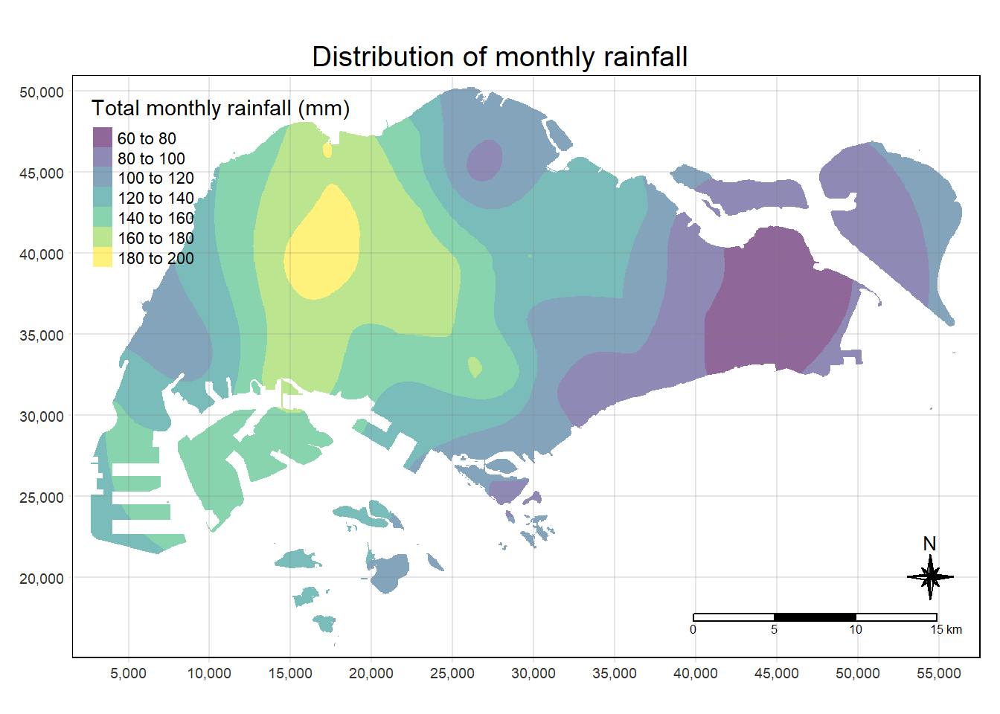
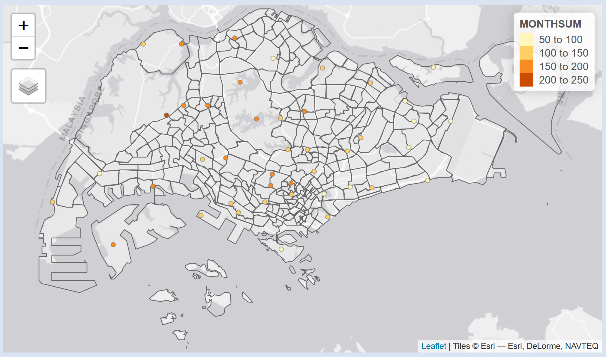
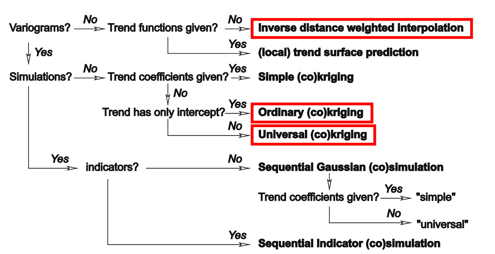
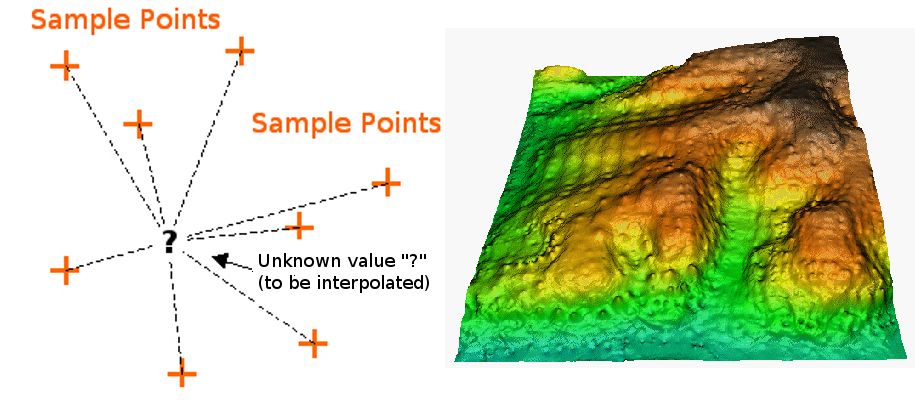
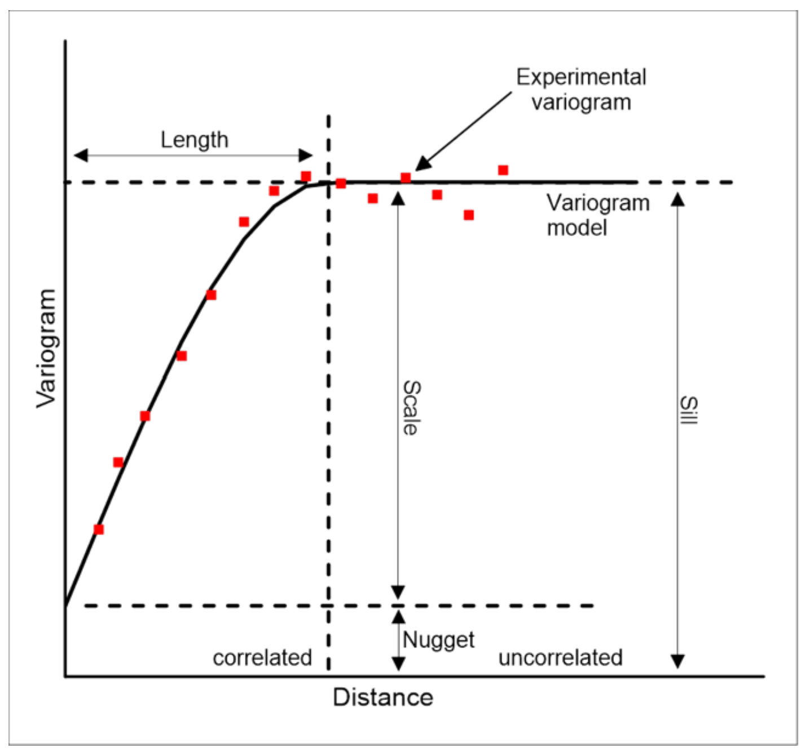

## Introduction

Spatial interpolation involves estimating values at unsampled locations based on known data points, and visualization techniques, like maps, are crucial for analysing and understanding the analysis results.

isohyet map is a surface map of the same precipitation: rain, snow, and others. Figure below is an isohyet map showing to spatial distribution of total monthly rainfall of Singapore in February 2024.



In order to prepare an isohyet map, spatial interpolation will be used. Spatial interpolation is the process of using points with known values to estimate values at other unknown points. For example, to make a rainfall above, we will not find enough evenly spread weather stations to cover the entire region. Spatial interpolation can estimate the rainfall at locations without recorded data by using known rainfall readings at nearby weather stations (see figure_temperature_map). This type of interpolated surface is often called a geostatistical surface. Elevation data, temperature, property prices, air quality index and population density are other types of data that can be computed using interpolation.



There are many interpolation methods. In this hands-on exercise, two widely used spatial interpolation methods called **Inverse Distance Weighting (IDW)** and **kriging** will be introduce. If you are looking for additional interpolation methods, please refer to the ‘Further Reading’ section at the end of this topic.

### Learning Outcome

By the end of this exercise, you will be able to:

-   create a grid data object by using `rast()` of **terra** package,
-   perform spatial interpolation by using Inverse Distance Weighted (IDW) and Ordinary Kriging methods of **gstat** package and auto-fitting kriging method of **automap** package, and
-   mapping the raster layers generated above by using appropriate functions provided by **tmap** package.

## Getting Started

In this in-class exercise, beside tidyverse, viridis, sf and tmap libaries, two new R packages will be used, they are:

-   [terra](https://rspatial.github.io/terra/index.html) is a replacement of the [raster](https://cran.r-project.org/web/packages/raster/index.html) package. It has a very similar, but simpler, interface, and it is faster than raster. In this hands-on exercise, it will be used to create grid (also known as raster) objects as the input and output of spatial interpolation.

-   [gstat](http://r-spatial.github.io/gstat/), an r packages for spatial and spatio-temporal geostatistical modelling, prediction and simulation. In this in-class exercise, it will be used to perform spatial interpolation.

-   [automap](https://cran.r-project.org/web/packages/automap/), an r package for performing automatic variogram modelling and kriging interpolation.

```{r}
pacman::p_load(sf, terra, gstat, automap,
               tmap, viridis, tidyverse)
```

## The Data

Three data sets will be used in this exercise, they are:

-   *RainfallStation.csv* provides location information of existing rainfall stations in Singapore. The data is downloaded from [Meteological Service Singapore](http://www.weather.gov.sg/home/).
-   *DAILYDATA_202402.csv* provides weather data are rainfall stations for the month February, 2024. The data is also downloaded from [Meteological Service Singapore](http://www.weather.gov.sg/home/).
-   *MPSZ-2019* contains planning subzone boundary of URA Master Plan 2019. It is downloaded from data.gov.sg. The original data is in kml format.

### Importing rainfall station data

In the code chunk below, `read_csv()` of **readr** package is used to import RainfallStation.csv. rfstations, the output object is in tibble data.frame format.

```{r}
rfstations <- read_csv("chap24/data/aspatial/RainfallStation.csv")
```

### Importing rainfall record data

In the code chunk below, `read_csv()` of **readr** package is used to import DAILYDATA_202402.csv. rfdata, the output object is in tibble data.frame format.

```{r}
rfdata <- read_csv("chap24/data/aspatial/DAILYDATA_202402.csv") %>%
  select(c(1, 5)) %>%
  group_by(Station) %>%
  summarise(MONTHSUM = sum(`Daily Rainfall Total (mm)`)) %>%
  ungroup()
```

::: callout-note
-   `select()` of **dplyr** package is used to retain column 1 and 5 of the input data.
-   `group_by()` and `summarise()` of **dplyr** package are used to compute the total monthly rainfall from *Daily Rainfall Total (mm)* field. The output is stored in a new field called *MONTHSUM*.
:::

### Converting aspatial data into geospatial data

Next, `left_join()` of *dplyr* is used to join *rfstations* to *rfdata* by using the code chunk below.

```{r}
rfdata <- rfdata %>%
  left_join(rfstations)
```

::: callout-note
Because *Station* field is available in both *rfstations* and *rfdata*, `by()` argument of `left_join()` is not needed.
:::

In the code chunk below, `st_as_sf()` of **sf** package is used to convert *rfdata* into a simple feature data.frame object called *rfdata_sf*.

```{r}
rfdata_sf <- st_as_sf(rfdata, 
                      coords = c("Longitude",
                                 "Latitude"),
                      crs= 4326) %>%
  st_transform(crs = 3414)
```

::: callout-note
-   For `coords` argument, it is important to map the X (i.e. Longitude) first, then follow by the Y (i.e. Latitude).
-   `crs = 4326` indicates that the source data is in wgs84 coordinates system.
-   `st_transform()` of **sf** package is then used to transform the source data from wgs84 to svy21 projected coordinates system.
-   *svy21* is the official projected coordinates of Singapore. *3414* is the EPSG code of svy21.
:::

### Importing planning subzone boundary data

In the code chunk below, `st_read()` of sf package is used to import MPSZ-2019 shapefile into R. The output is called *mpsz2019*. It is in polygon feature tibble data.frame format.

```{r}
mpsz2019 <- st_read(dsn = "chap24/data/geospatial", 
                    layer = "MPSZ-2019") %>%
  st_transform(crs = 3414)
```

::: callout-note
-   The source data is in wgs84 coordinates system, hence `st_tranform()` of **sf** package is used to theo output sf data.frame into svy21 project coordinates system.
:::

### Visualising the data prepared

It is always a good practice to visualise the data prepared. In the code chunk below, tmap functions are used to create a dot map showing locations of rainfall station in Singapore.

```{r}
tm_check_fix()
tmap_mode("view")
tm_shape(rfdata_sf) +
  tm_dots(fill = "red")
tmap_mode("plot")
```

In the code chunk below, tmap functions are used to create a quantitative dot map of rainfall distribution by rainfall station in Singaspore.

```{r}
tm_check_fix()
tmap_mode("view")
tm_shape(mpsz2019) +
  tm_borders() +
tm_shape(rfdata_sf) +
  tm_dots(fill = 'MONTHSUM')
tmap_mode("plot")
```

## Spatial Interpolation: gstat method

In this section, you will gain hands-on experience on performing spatial interpolation by using **gstat** package. In order to perform spatial interpolation by using gstat, we first need to create an object of class called *gstat*, using a function of the same name: `gstat`. A gstat object contains all necessary information to conduct spatial interpolation, namely:

-   The model definition
-   The calibration data

Based on its arguments, the gstat function “understands” what type of interpolation model we want to use:

-   No variogram model → IDW
-   Variogram model, no covariates → Ordinary Kriging
-   Variogram model, with covariates → Universal Kriging

The complete decision tree of `gstat`, including several additional methods which we are not going to use, is shown in the figure below.



### Data preparation

To getting start, we need create a grid data object by using `rast()` of **terra** package as shown in the cod chunk below.

```{r}
grid <- terra::rast(mpsz2019, 
                    nrows = 690, 
                    ncols = 1075)
grid
```

Next, a list called xy will be created by using `xyFromCell()` of **terra** package.

```{r}
xy <- terra::xyFromCell(grid, 
                        1:ncell(grid))
head(xy)
```

::: callout-note
`xyFromCell()` gets coordinates of the center of raster cells for a row, column, or cell number of a SpatRaster. Or get row, column, or cell numbers from coordinates or from each other.
:::

Lastly, we will create a data frame called *coop* with prediction/simulation locations by using the code chunk below.

```{r}
coop <- st_as_sf(as.data.frame(xy), 
                 coords = c("x", "y"),
                 crs = st_crs(mpsz2019))
coop <- st_filter(coop, mpsz2019)
head(coop)
```

## Inverse Distance Weighted (IDW)

### The method

In the IDW interpolation method, the sample points are weighted during interpolation such that the influence of one point relative to another declines with distance from the unknown point you want to create.



Weighting is assigned to sample points through the use of a weighting coefficient that controls how the weighting influence will drop off as the distance from new point increases. The greater the weighting coefficient, the less the effect points will have if they are far from the unknown point during the interpolation process. As the coefficient increases, the value of the unknown point approaches the value of the nearest observational point.

It is important to notice that the IDW interpolation method also has some disadvantages: the quality of the interpolation result can decrease, if the distribution of sample data points is uneven. Furthermore, maximum and minimum values in the interpolated surface can only occur at sample data points. This often results in small peaks and pits around the sample data points.

### Working with **gstat**

We are going to use three parameters of the gstat function:

-   formula: The prediction “formula” specifying the dependent and the independent variables (covariates)
-   data: The calibration data
-   model: The variogram model

Keep in mind that we need to specify parameter names, because these three parameters are not the first three in the gstat function definition.

For example, to interpolate using the IDW method we create the following gstat object, specifying just the formula and data:

`g = gstat(formula = annual ~ 1, data = rainfall)`

::: callout-tip
In R, formula objects are used to specify relation between objects, in particular—the role of different data columns in statistical models. A formula object is created using the \~ operator, which separates names of dependent variables (to the left of the \~ symbol) and independent variables (to the right of the \~ symbol). Writing 1 to the right of the \~ symbol, as in \~ 1, means that there are no independent variables38.
:::

In the code chunk below,

```{r}
res <- gstat(formula = MONTHSUM ~ 1, 
             locations = rfdata_sf, 
             nmax = 5,
             set = list(idp = 0))
```

::: callout-important
Spatial interpolation is not a rocket science, students should try to explore the method by changing `nmax` argument in order to understand how the final surface map will be affected by different nmax values.
:::

Now that our model is defined, we can use `predict()` to actually interpolate, i.e., to calculate predicted values. The predict function accepts:

-   A raster—stars object, such as dem
-   A model—gstat object, such as g

The raster serves for two purposes:

-   Specifying the locations where we want to make predictions (in all methods), and
-   Specifying covariate values (in Universal Kriging only).

```{r}
resp <- predict(res, coop)
resp$x <- st_coordinates(resp)[,1]
resp$y <- st_coordinates(resp)[,2]
resp$pred <- resp$var1.pred

pred <- terra::rasterize(resp, grid, 
                         field = "pred", 
                         fun = "mean")
```

### Mapping the interpolated rainfall raster

Now, we will map the interpolated surface by using tmap functions as shown in the code chunk below.

```{r}
tm_check_fix()
tmap_mode("plot")
tm_shape(pred) + 
  tm_raster(col_alpha = 0.6, 
            col.scale = tm_scale(
              values = "brewer.blues"))
```

## Kriging

### The method

Kriging is one of several methods that use a limited set of sampled data points to estimate the value of a variable over a continuous spatial field. An example of a value that varies across a random spatial field might be total monthly rainfall over Singapore. It differs from Inverse Distance Weighted Interpolation discussed earlier in that it uses the spatial correlation between sampled points to interpolate the values in the spatial field: the interpolation is based on the spatial arrangement of the empirical observations, rather than on a presumed model of spatial distribution. Kriging also generates estimates of the uncertainty surrounding each interpolated value.

In a general sense, the kriging weights are calculated such that points nearby to the location of interest are given more weight than those farther away. Clustering of points is also taken into account, so that clusters of points are weighted less heavily (in effect, they contain less information than single points). This helps to reduce bias in the predictions.

The kriging predictor is an “optimal linear predictor” and an exact interpolator, meaning that each interpolated value is calculated to minimize the prediction error for that point. The value that is generated from the kriging process for any actually sampled location will be equal to the observed value at this point, and all the interpolated values will be the Best Linear Unbiased Predictors (BLUPs).

Kriging will in general not be more effective than simpler methods of interpolation if there is little spatial autocorrelation among the sampled data points (that is, if the values do not co-vary in space). If there is at least moderate spatial autocorrelation, however, kriging can be a helpful method to preserve spatial variability that would be lost using a simpler method (for an example, see Auchincloss 2007, below).

Kriging can be understood as a two-step process:

-   first, the spatial covariance structure of the sampled points is determined by fitting a variogram; and
-   second, weights derived from this covariance structure are used to interpolate values for unsampled points or blocks across the spatial field.

Kriging methods require a **variogram** model. A variogram (sometimes called a “**semivariogram**”) is a visual depiction of the covariance exhibited between each pair of points in the sampled data. For each pair of points in the sampled data, the gamma-value or “semi-variance” (a measure of the half mean-squared difference between their values) is plotted against the distance, or “lag”, between them. The “experimental” variogram is the plot of observed values, while the “theoretical” or “model” variogram is the distributional model that best fits the data.



### Working with **gstat**

Firstly, we will calculate and examine the empirical variogram by using `variogram()` of **gstat** package. The function requires two arguments:

-   formula, the dependent variable and the covariates (same as in gstat, see Section 12.2.1)
-   data, a point layer with the dependent variable and covariates as attributes

as shown in the code chunk below.

```{r}
v <- variogram(MONTHSUM ~ 1, 
               data = rfdata_sf)
plot(v)
```

We can then compare the plot with the theoretical models below.

```{r}
#| echo: false
show.vgms()
```

With reference to the comparison above, am empirical variogram model will be fitted by using `fit.variogram()` of **gstat** package as shown in the code chunk below.

```{r}
fv <- fit.variogram(object = v,
                    model = vgm(
                      psill = 0.5, 
                      model = "Sph",
                      range = 5000, 
                      nugget = 0.1))
fv
```

::: callout-important
Spatial interpolation is not a rocket science, students should try to explore the method by changing `psill`, `model`, `range`, `nugget` arguments in order to understand how the final surface map will be affected by different options used.
:::

We can visualise how well the observed data fit the model by plotting *fv* using the code chunk below.

```{r}
plot(v, fv)
```

The plot above reveals that the empirical model fits rather well. In view of this, we will go ahead to perform spatial interpolation by using the newly derived model as shown in the code chunk below.

```{r}
k <- gstat(formula = MONTHSUM ~ 1, 
           data = rfdata_sf, 
           model = fv)
k
```

Once we are happy with the results, predict() of gstat package will be used to estimate the unknown grids by using the code chunk below.

```{r}
resp <- predict(k, coop)
resp$x <- st_coordinates(resp)[,1]
resp$y <- st_coordinates(resp)[,2]
resp$pred <- resp$var1.pred
resp$pred <- resp$pred
resp
```

::: callout-note
*resp* is a sf tibble data.frame with point features.
:::

In order to create a raster surface data object, rasterize() of terra is used as shown in the code chunk below.

```{r}
kpred <- terra::rasterize(resp, grid, 
                         field = "pred")
kpred
```

::: callout-note
The output object *kpred* is in SpatRaster object class with a spatial resolution of 50m x 50m. It consists of 1075 columns and 690 rows and in SVY21 projected coordinates system.
:::

### Mapping the interpolated rainfall raster

Finally, tmap functions are used to map the interpolated rainfall raster (i.e. kpred) by using the code chunk below.

```{r}
tm_check_fix()
tmap_mode("plot")
tm_shape(kpred) + 
  tm_raster(col_alpha = 0.6, 
            col.scale = tm_scale_continuous(
              values = "brewer.blues"),
            col.legend = tm_legend(
              "Total monthly\n rainfall (mm)")) +
  tm_title("Distribution of monthly rainfall, Feb 2024") + tm_layout(frame = TRUE) +
  tm_compass(type="8star", size = 2) +
  tm_grid(alpha =0.2)
```

### Automatic variogram modelling

Beside using gstat to perform variogram modelling manually, `autofitVariogram()` of [**automap**](https://cran.r-project.org/web/packages/automap/) package can be used to perform varigram modelling as shown in the code chunk below.

```{r}
v_auto <- autofitVariogram(MONTHSUM ~ 1, 
                           rfdata_sf)
plot(v_auto)
```

```{r}
v_auto
```

```{r}
k <- gstat(formula = MONTHSUM ~ 1, 
           model = v_auto$var_model,
           data = rfdata_sf)
k
```

```{r}
resp <- predict(k, coop)
resp$x <- st_coordinates(resp)[,1]
resp$y <- st_coordinates(resp)[,2]
resp$pred <- resp$var1.pred
resp$pred <- resp$pred

kpred <- terra::rasterize(resp, grid, 
                         field = "pred")
```

```{r}
tm_check_fix()
tmap_mode("plot")
tm_shape(kpred) + 
  tm_raster(col_alpha = 0.6, 
            col.scale = tm_scale_continuous(
              values = "brewer.blues"),
            col.legend = tm_legend(
              "Total monthly\n rainfall (mm)")) +
  tm_title("Distribution of monthly rainfall, Feb 2024") + tm_layout(frame = TRUE) +
  tm_compass(type="8star", size = 2) +
  tm_grid(alpha =0.2)
```

## Reference

[Spatial Interpolation Methods: Global vs. local interpolation](https://iri.columbia.edu/~rijaf/CDTUserGuide/html/interpolation_methods.html)

Olea, Ricardo A. (2006-07) "A six-step practical approach to semivariogram modeling", *Stochastic Environmental Research and Risk Assessment*, 2006-07, Vol.20 (5), p.307-318. SMU e-journal.

Tommaso Caloiero et. al. (2021) "[Comparative Analysis of Different Spatial Interpolation Methods Applied to Monthly Rainfall as Support for Landscape Management](https://www.mdpi.com/2076-3417/11/20/9566)", *Applied Science*, 11, 9566. https://doi.org/10.3390/app11209566.
